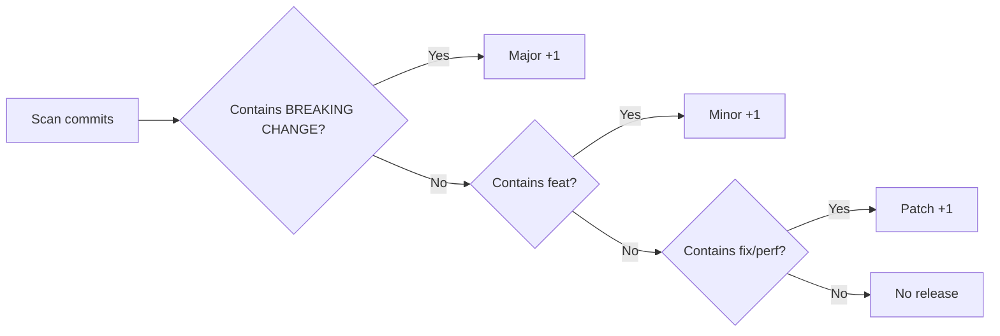

# Commit Message Convention (Conventional Commits)

[中文版本](./CONTRIBUTING_zh.md)

This project follows the [Conventional Commits](https://www.conventionalcommits.org/) specification.  
This specification works with [Semantic Versioning (SemVer)](https://semver.org/) to enable **automated version management** and **automatic CHANGELOG generation**.

---

## 1. Commit Message Format

```
<type>(<scope>): <subject>

<body>

<footer>
```

| Part | Required | Description |
|------|----------|-------------|
| `type` | ✅ Required | Commit type, determines how the version number changes |
| `scope` | ⬜ Optional | Affected scope (module name), e.g., `parser`, `renderer`, `preview` |
| `subject` | ✅ Required | Brief description, no more than 72 characters, **no period** |
| `body` | ⬜ Optional | Detailed explanation of "why" and "how" |
| `footer` | ⬜ Optional | Related Issues, Breaking Change descriptions, etc. |

---

## 2. Type Quick Reference

### 2.1 Types That Affect Version Number

| Type | Description | SemVer Impact | Example |
|------|-------------|---------------|---------|
| `feat` | ✨ **New feature** | Bumps Minor (x.**Y**.0) | Add new LaTeX command support |
| `fix` | 🐛 **Bug fix** | Bumps Patch (x.y.**Z**) | Fix parser crash issue |
| `perf` | ⚡ **Performance improvement** | Bumps Patch (x.y.**Z**) | Optimize rendering performance |

### 2.2 Types That Do Not Affect Version Number

| Type | Description | Example |
|------|-------------|---------|
| `docs` | 📝 Documentation changes | Update README, PARSER_COVERAGE_ANALYSIS |
| `style` | 💄 Code formatting (no logic change) | Adjust indentation, remove extra blank lines |
| `refactor` | ♻️ Refactoring (neither bug fix nor new feature) | Refactor Measurer architecture |
| `test` | ✅ Test-related | Add unit tests, fix tests |
| `build` | 🔧 Build system/dependency changes | Upgrade Gradle, update Kotlin version |
| `ci` | 👷 CI/CD configuration | Modify GitHub Actions workflow |
| `chore` | 🔨 Other miscellaneous | Update .gitignore, IDE configuration |
| `revert` | ⏪ Revert commit | Revert an erroneous commit |

### 2.3 Breaking Change (Major Version Upgrade)

Adding `BREAKING CHANGE:` in the footer or appending `!` after the type triggers a **Major version upgrade** (**X**.0.0):

```
feat(parser)!: refactor AST node structure

BREAKING CHANGE: The LatexNode interface signature has changed; all custom nodes need to adapt to the new interface.
```

---

## 3. Commit Examples by Scenario

### 3.1 ✨ New Feature (feat)

```bash
# Basic format
git commit -m "feat(parser): support \colorbox and \fcolorbox command parsing"

# Detailed format with scope
git commit -m "feat(renderer): implement matrix environment bracket rendering

Support delimiter rendering for pmatrix, bmatrix, vmatrix and other matrix environments,
using KaTeX Size font progressive selection scheme.

Closes #18"

# Multi-module coordination
git commit -m "feat: support hyperlink and background color rendering

- parser: add \href, \url, \colorbox, \fcolorbox parsing
- renderer: implement corresponding Measurer and drawing logic
- preview: add preview examples to corresponding groups

Closes #25"
```

### 3.2 🐛 Bug Fix (fix)

```bash
# Basic format
git commit -m "fix(parser): fix stack overflow when parsing nested curly braces"

# With detailed description
git commit -m "fix(renderer): fix italic character right-side clipping

The ink bounds of italic characters exceed the logical bounds, causing the
last character to be clipped on the right side.
Added italicOverhang compensation using px units for offset calculation.

Fixes #14"

# Fix build issue
git commit -m "fix(build): Maven repository configuration causes Gradle sync failure"
```

### 3.3 ⚡ Performance Improvement (perf)

```bash
git commit -m "perf(parser): optimize incremental parsing performance

Skip already-parsed AST nodes in prefix-match scenarios,
reducing parsing time by approximately 40%."

git commit -m "perf(renderer): cache TextStyle instances to avoid repeated creation"
```

### 3.4 ♻️ Refactoring (refactor)

```bash
git commit -m "refactor(renderer): decouple CommandParser into an independent module"

git commit -m "refactor(parser): make LatexNode self-descriptive

Encapsulate type information within the node itself, eliminating type
checking logic in external visitors."
```

### 3.5 📝 Documentation (docs)

```bash
git commit -m "docs: update README with installation instructions"

git commit -m "docs(parser): update PARSER_COVERAGE_ANALYSIS to mark newly supported commands"
```

### 3.6 ✅ Tests (test)

```bash
git commit -m "test(parser): add unit tests for \overbracket and \underbracket"

git commit -m "test(parser): add edge case tests for matrix parsing"
```

### 3.7 🔧 Build/Dependencies (build)

```bash
git commit -m "build: upgrade Kotlin to 2.1.0"

git commit -m "build: update Compose Multiplatform to 1.7.3

Also update gradle.properties and libs.versions.toml."
```

### 3.8 🔖 Version Release (chore/release)

```bash
git commit -m "chore(release): release v1.3.0"

git commit -m "chore(release): bump version to 1.2.5"
```

### 3.9 ⏪ Revert (revert)

```bash
git commit -m "revert: feat(parser): support \colorbox command parsing

This reverts commit abc1234.
Reason: This feature has rendering compatibility issues on the iOS platform and requires further investigation."
```

---

## 4. Scope Reference

The following scopes are recommended for this project:

| Scope | Module | Description |
|-------|--------|-------------|
| `parser` | `latex-parser` | LaTeX parser |
| `renderer` | `latex-renderer` | Rendering engine |
| `preview` | `latex-preview` | Preview module |
| `base` | `latex-base` | Base common module |
| `build` | Root project build | Gradle configuration, dependency management |
| `android` | `androidapp` | Android application |
| `ios` | `iosApp` | iOS application |
| `app` | `composeApp` | Compose Multiplatform application |

> If changes span multiple modules, the scope can be omitted and the changes for each module can be described in the body.

---

## 5. MR (Merge Request) Submission Guidelines

### 5.1 MR Title Format

MR titles should follow the same Conventional Commits format as commits:

```
<type>(<scope>): <brief description>
```

**Examples:**

| Scenario | MR Title |
|----------|----------|
| New feature | `feat(parser): support \colorbox and \fcolorbox commands` |
| Bug fix | `fix(renderer): fix delimiter clipping on high-DPI displays` |
| Performance | `perf(parser): optimize incremental parsing for large documents` |
| Refactoring | `refactor(renderer): unify delimiter rendering path` |
| Version release | `chore(release): v1.3.0` |
| Multi-feature merge | `feat: support hyperlinks, background colors, and bracket annotations` |

### 5.2 MR Description Template

```markdown
## Summary of Changes
<!-- Briefly describe what this MR does -->

## Change Type
- [ ] ✨ New feature (feat)
- [ ] 🐛 Bug fix (fix)
- [ ] ♻️ Refactoring (refactor)
- [ ] ⚡ Performance improvement (perf)
- [ ] 📝 Documentation (docs)
- [ ] ✅ Tests (test)
- [ ] 🔧 Build/CI (build/ci)

## Affected Modules
- [ ] latex-parser
- [ ] latex-renderer
- [ ] latex-preview
- [ ] latex-base
- [ ] composeApp / androidapp / iosApp

## Self-Check Checklist
- [ ] `./run_parser_tests.sh` all passed
- [ ] Unit tests added for new features
- [ ] Test cases added to the correct feature category test file
- [ ] Preview examples added to the correct PreviewGroup
- [ ] Rendering verified on at least one of Android / iOS / Desktop
- [ ] (If applicable) Updated PARSER_COVERAGE_ANALYSIS.md

## Related Issues
<!-- Closes #xxx or Fixes #xxx -->
```

---

## 6. Version Number and Commit Type Mapping

```
Version format: MAJOR.MINOR.PATCH (e.g., 1.3.2)

Commit Type          →  Version Change         →  Trigger Condition
─────────────────────────────────────────────────────────────────────
feat                 →  1.2.0 → 1.3.0          →  New feature
fix / perf           →  1.2.0 → 1.2.1          →  Fix / Optimization
BREAKING CHANGE      →  1.2.0 → 2.0.0          →  Incompatible change
docs/style/test      →  No change              →  No impact on artifacts
```

### Automated Version Generation Flow (Semantic Release)



---

## 7. Common Mistakes

```bash
# ❌ Missing type
git commit -m "fixed a bug"

# ❌ Missing colon and space after type
git commit -m "featfix parser"

# ❌ Subject too vague
git commit -m "fix: fixed some issues"

# ❌ Non-English type
git commit -m "功能(parser): support new command"

# ✅ Correct format
git commit -m "fix(parser): fix \frac parsing error when nesting exceeds 3 levels"
```

---

## 8. Git Hooks Auto-Validation (Optional)

You can use [commitlint](https://commitlint.js.org/) with git hooks to automatically validate commit message format:

```bash
# Install (Node.js environment)
npm install --save-dev @commitlint/cli @commitlint/config-conventional

# Create commitlint.config.js
echo "module.exports = { extends: ['@commitlint/config-conventional'] };" > commitlint.config.js

# Set up commit-msg hook with husky
npx husky add .husky/commit-msg 'npx --no -- commitlint --edit "$1"'
```

---

## 9. Quick Reference Card

```
feat(scope): new feature description       → Minor bump
fix(scope): what was fixed                  → Patch bump
perf(scope): what was optimized             → Patch bump
refactor(scope): what was refactored        → No bump
docs(scope): what docs were updated         → No bump
test(scope): what tests were added/changed  → No bump
build(scope): build/dependency changes      → No bump
chore(release): vX.Y.Z                     → Version tag
feat(scope)!: xxx                          → Major bump (breaking change)
```
