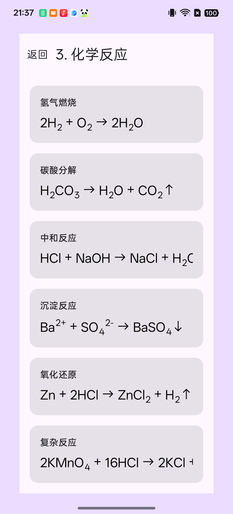
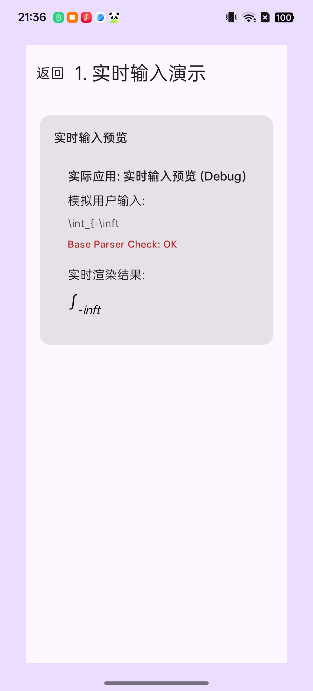

# Kotlin Multiplatform LaTeX Rendering Library

[](https://kotlinlang.org)
[](https://www.jetbrains.com/lp/compose-multiplatform/)
[](https://android-arsenal.com/api?level=24)
[](LICENSE)
[](https://central.sonatype.com/search?q=io.github.huarangmeng.latex)

这是一个基于 Kotlin Multiplatform (KMP) 开发的高性能 LaTeX 数学公式解析与渲染库。支持在 Android, iOS, Desktop (JVM) 和 Web (Wasm/JS) 平台上实现一致的渲染效果。

[English Version](./README.md)

## 🌟 核心特性

- **完整语法支持**：涵盖 100+ 希腊字母、基础算术、矩阵、环境（align, cases, array 等）。
- **自定义命令**：支持 `\newcommand` 宏定义，包括参数替换（#1-#9）、嵌套定义和命令覆盖。
- **高性能解析**：基于 AST 的递归下降解析器，支持增量更新。
- **多平台一致性**：使用 Compose Multiplatform 实现跨平台 UI 渲染。
- **化学公式支持**：内置 `\ce{...}` 插件支持。
- **样式定制**：支持颜色（`\color`）、方框（`\boxed`）和数学模式切换（`\displaystyle` 等）。
- **自动换行**：长公式在逻辑断点（运算符、关系符）处智能换行。
- **图片导出**：将渲染结果导出为 PNG/JPEG/WEBP 图片，支持分辨率缩放配置。
- **无障碍支持**：内置屏幕阅读器支持，基于 MathSpeak 风格生成公式的自然语言描述。
- **所见即所得编辑器** *（实验性）*：内置 LaTeX 编辑器，支持光标定位、点击定位和实时渲染预览。

## 📸 渲染预览

项目包含一个演示 App (`composeApp`/`androidApp`)，展示了各种复杂的 LaTeX 场景：

| 基础数学 | 化学公式 | 增量解析 |
| :---: | :---: | :---: |
|  |  |  |
| 基础数学公式渲染 | 支持 `\ce{...}` 语法 | 支持不完整输入的实时预览 |

## 🛠️ 使用方法

在 Compose Multiplatform 项目中，你可以直接使用 `Latex` 组件。该组件会自动处理增量解析，支持实时预览：

```kotlin
import com.hrm.latex.renderer.Latex
import com.hrm.latex.renderer.model.LatexConfig
import androidx.compose.ui.graphics.Color
import androidx.compose.ui.unit.sp

@Composable
fun MyScreen() {
    Latex(
        latex = "\\frac{-b \\pm \\sqrt{b^2 - 4ac}}{2a}",
        config = LatexConfig(
            fontSize = 20.sp,
            color = Color.Black,
            darkColor = Color.White // 自动支持深色模式
        )
    )
}
```

### 自动换行

对于需要在容器宽度内自动换行的长公式，使用 `LatexAutoWrap`：

```kotlin
import com.hrm.latex.renderer.LatexAutoWrap

@Composable
fun MyScreen() {
    LatexAutoWrap(
        latex = "E = mc^2 + \\frac{p^2}{2m} + V(x) + \\frac{1}{2}kx^2",
        modifier = Modifier.fillMaxWidth(),
        config = LatexConfig(fontSize = 20.sp)
    )
}
```

换行发生在数学上有效的位置：关系运算符（`=`、`<`、`>`），然后是加法运算符（`+`、`-`），然后是乘法运算符（`×`、`÷`）。分数、根号、矩阵等原子结构不会被拆分。

### 图片导出

将渲染后的 LaTeX 公式导出为 PNG、JPEG 或 WEBP 图片。在 Composable 作用域中使用 `rememberLatexExporter()` 创建导出器，然后在后台线程中调用 `export()` 方法：

```kotlin
import com.hrm.latex.renderer.export.*
import kotlinx.coroutines.Dispatchers
import kotlinx.coroutines.launch

@Composable
fun MyScreen() {
    val exporter = rememberLatexExporter()
    val scope = rememberCoroutineScope()

    Button(onClick = {
        scope.launch(Dispatchers.Default) {
            // 导出为 PNG（默认，2 倍分辨率）
            val result = exporter.export("E = mc^2")
            val pngBytes = result?.bytes       // PNG 字节数组
            val bitmap = result?.imageBitmap    // 可直接在 Compose 中展示

            // 导出为 JPEG（3 倍分辨率，质量 85）
            val jpegResult = exporter.export(
                latex = "\\frac{a}{b}",
                exportConfig = ExportConfig(
                    scale = 3f,
                    format = ImageFormat.JPEG,
                    quality = 85
                )
            )

            // 导出透明背景（仅 PNG 支持）
            val transparentResult = exporter.export(
                latex = "x^2 + y^2 = r^2",
                exportConfig = ExportConfig(transparentBackground = true)
            )
        }
    }) {
        Text("导出")
    }
}
```

`ExportConfig` 参数说明：

| 参数 | 类型 | 默认值 | 说明 |
|------|------|--------|------|
| `scale` | `Float` | `2f` | 分辨率倍率（1x、2x、3x 等） |
| `format` | `ImageFormat` | `PNG` | `ImageFormat.PNG`、`ImageFormat.JPEG` 或 `ImageFormat.WEBP` |
| `transparentBackground` | `Boolean` | `false` | 是否使用透明背景（PNG 和 WEBP 支持；JPEG 始终使用不透明背景） |
| `quality` | `Int` | `90` | JPEG 和 WEBP 的压缩质量（1–100，PNG 忽略此参数） |

### 无障碍支持

本库内置了屏幕阅读器无障碍支持。启用后，每个 `Latex` 组件会通过 Compose Semantics 暴露 MathSpeak 风格的自然语言描述，使数学公式能够被 TalkBack（Android）、VoiceOver（iOS）等辅助技术正确朗读。

```kotlin
Latex(
    latex = "\\frac{1}{2}",
    config = LatexConfig(accessibilityEnabled = true)
)
// 屏幕阅读器朗读: "fraction: 1 over 2"
```

`AccessibilityVisitor` 会将 LaTeX AST 转换为描述性文本，覆盖分数、根号、上下标、矩阵、希腊字母、运算符等结构。

### 所见即所得编辑器（实验性）

> **注意**：编辑器 API 目前处于实验阶段，后续版本中可能会发生变更。所有编辑器 API 需要添加 `@ExperimentalComposeUiApi` 注解。

本库内置了所见即所得（WYSIWYG）LaTeX 编辑器组件。用户可以编辑 LaTeX 源文本并实时查看渲染结果，光标位置在源文本和渲染输出之间保持同步。

```kotlin
@OptIn(ExperimentalComposeUiApi::class)
@Composable
fun MyEditor() {
    val editorState = rememberEditorState(initialText = "x^{2} + y^{2} = r^{2}")

    LatexEditor(
        editorState = editorState,
        config = LatexConfig(fontSize = 20.sp),
        showSourceText = true // 显示源文本输入框
    )
}
```

## 📦 安装

在 `gradle/libs.versions.toml` 中添加依赖：

```toml
[versions]
latex = "1.1.1"

[libraries]
latex-base = { module = "io.github.huarangmeng:latex-base", version.ref = "latex" }
latex-parser = { module = "io.github.huarangmeng:latex-parser", version.ref = "latex" }
latex-renderer = { module = "io.github.huarangmeng:latex-renderer", version.ref = "latex" }
```

在模块的 `build.gradle.kts` 中引用：

```kotlin
dependencies {
    implementation(libs.latex.base) // 基础日志
    implementation(libs.latex.renderer) // 渲染逻辑
    implementation(libs.latex.parser) // 解析逻辑
}
```

## 🏗️ 项目结构

- `:latex-base`: 基础数据结构和接口。
- `:latex-parser`: 核心解析引擎，负责将 LaTeX 字符串转换为 AST。
- `:latex-renderer`: 负责将 AST 渲染为 Compose UI 组件。
- `:latex-preview`: 预览组件和示例数据集。
- `:composeApp`: 跨平台 Demo 应用程序。
- `:androidApp`: Android Demo 应用程序。

## 🚀 快速开始

### 运行 Demo App

- **Android**: `./gradlew :androidApp:assembleDebug`
- **Desktop**: `./gradlew :composeApp:run`
- **Web (Wasm)**: `./gradlew :composeApp:wasmJsBrowserDevelopmentRun`
- **iOS**: 在 Xcode 中打开 `iosApp/iosApp.xcworkspace` 运行。

### 运行测试

```bash
./run_parser_tests.sh
```

## 📊 路线图与功能覆盖

详细的功能支持列表请参阅：[PARSER_COVERAGE_ANALYSIS.md](./latex-parser/PARSER_COVERAGE_ANALYSIS.md)

## 🙏 致谢

- [KaTeX](https://github.com/KaTeX/KaTeX) — 本项目使用了 KaTeX 的字体文件用于数学公式渲染。KaTeX 基于 [MIT License](https://github.com/KaTeX/KaTeX/blob/main/LICENSE) 开源。

## 📄 开源协议

本项目采用 MIT License 开源协议 - 详见 [LICENSE](LICENSE) 文件。

```
MIT License

Copyright (c) 2026 huarangmeng

特此免费授予任何获得本软件及相关文档文件（"软件"）副本的人不受限制地处理
软件的权利，包括但不限于使用、复制、修改、合并、发布、分发、再许可和/或
销售软件副本的权利，以及允许获得软件的人这样做，但须符合以下条件：

上述版权声明和本许可声明应包含在软件的所有副本或主要部分中。

本软件按"原样"提供，不提供任何形式的明示或暗示保证，包括但不限于对适销性、
特定用途的适用性和非侵权性的保证。在任何情况下，作者或版权持有人均不对
因软件或软件的使用或其他交易而产生的任何索赔、损害或其他责任承担责任，
无论是在合同诉讼、侵权行为还是其他方面。
```
